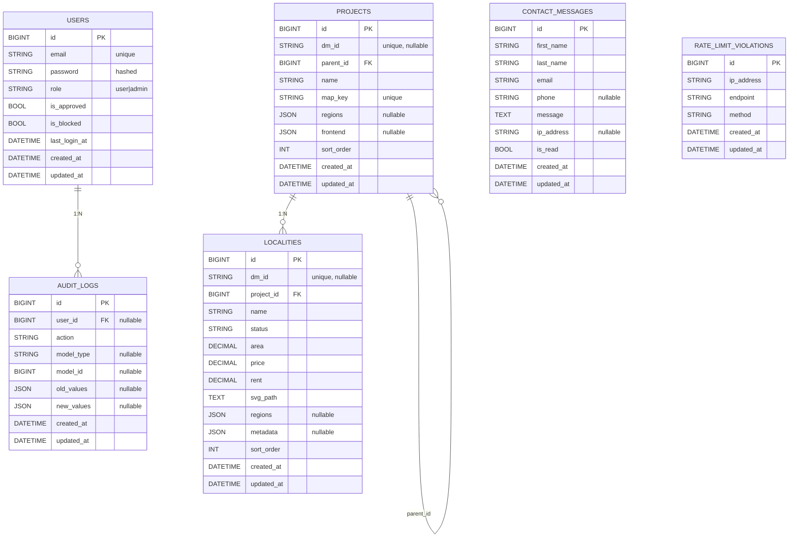

# ER diagram (databáza)

Tento ER diagram dopĺňa dokumentáciu k semestrálnej práci (Termín 1).

Poznámka: Diagram je zjednodušený a zameraný na hlavné entity používané v aplikácii.

```mermaid
erDiagram
  PROJECTS {
    BIGINT id PK
    STRING dm_id "unique, nullable"
    BIGINT parent_id FK
    STRING name
    STRING map_key "unique"
    JSON regions "nullable"
    JSON frontend "nullable"
    INT sort_order
    DATETIME created_at
    DATETIME updated_at
  }

  LOCALITIES {
    BIGINT id PK
    STRING dm_id "unique, nullable"
    BIGINT project_id FK
    STRING name
    STRING status
    DECIMAL area
    DECIMAL price
    DECIMAL rent
    TEXT svg_path
    JSON regions "nullable"
    JSON metadata "nullable"
    INT sort_order
    DATETIME created_at
    DATETIME updated_at
  }

  USERS {
    BIGINT id PK
    STRING email "unique"
    STRING password "hashed"
    STRING role "user|admin"
    BOOL is_approved
    BOOL is_blocked
    DATETIME last_login_at
    DATETIME created_at
    DATETIME updated_at
  }

  AUDIT_LOGS {
    BIGINT id PK
    BIGINT user_id FK "nullable"
    STRING action
    STRING model_type "nullable"
    BIGINT model_id "nullable"
    JSON old_values "nullable"
    JSON new_values "nullable"
    DATETIME created_at
    DATETIME updated_at
  }

  CONTACT_MESSAGES {
    BIGINT id PK
    STRING first_name
    STRING last_name
    STRING email
    STRING phone "nullable"
    TEXT message
    STRING ip_address "nullable"
    BOOL is_read
    DATETIME created_at
    DATETIME updated_at
  }

  RATE_LIMIT_VIOLATIONS {
    BIGINT id PK
    STRING ip_address
    STRING endpoint
    STRING method
    DATETIME created_at
    DATETIME updated_at
  }

  PROJECTS ||--o{ LOCALITIES : "1:N"
  PROJECTS ||--o{ PROJECTS : "parent_id"
  USERS ||--o{ AUDIT_LOGS : "1:N"
```

